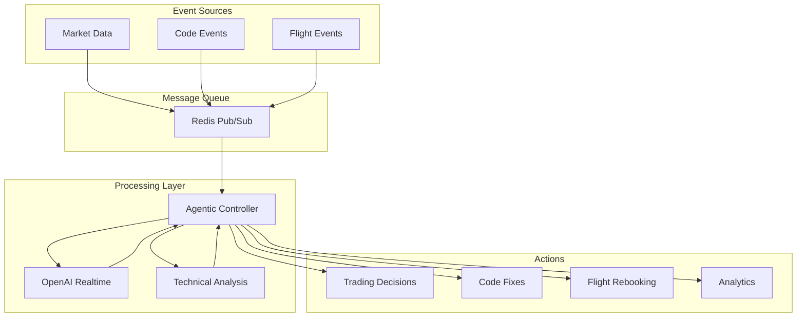

# Inflight System - Deno/TypeScript Implementation Specification

## Overview

This document outlines the technical specification for implementing the Inflight System in Deno/TypeScript, focusing on real-time event processing, agentic decision making, and WebSocket-based integrations.

## Core Dependencies

```typescript
// deps.ts
export {
  WebSocket,
  WebSocketClient,
} from "https://deno.land/std@0.220.1/ws/mod.ts";
export {
  assertEquals,
  assertExists,
} from "https://deno.land/std@0.220.1/assert/mod.ts";
export { Decimal } from "https://deno.land/x/decimal@v1.0/mod.ts";
export {
  connect as redisConnect,
  Redis,
} from "https://deno.land/x/redis@v0.32.1/mod.ts";
```

## Architecture



## Core Components

### 1. OpenAI Realtime Integration

```typescript
// src/openai/realtime_client.ts
import { WebSocket } from "../../deps.ts";

interface RealtimeLLMConfig {
  apiKey: string;
  modalities: string[];
  maxRetries?: number;
  retryDelay?: number;
}

export class RealtimeLLMClient {
  private ws: WebSocket | null = null;
  private config: RealtimeLLMConfig;

  constructor(config: RealtimeLLMConfig) {
    this.config = {
      maxRetries: 3,
      retryDelay: 1000,
      ...config,
    };
  }

  async createSession(): Promise<void> {
    const url = "wss://api.openai.com/v1/chat/completions/stream";
    this.ws = new WebSocket(url, {
      headers: {
        "Authorization": `Bearer ${this.config.apiKey}`,
        "Content-Type": "application/json",
      },
    });

    return new Promise((resolve, reject) => {
      this.ws?.addEventListener("open", () => resolve());
      this.ws?.addEventListener("error", (e) => reject(e));
    });
  }

  async streamText(prompt: string): Promise<AsyncGenerator<string, void, void>> {
    if (!this.ws) {
      await this.createSession();
    }

    // Send message
    this.ws?.send(JSON.stringify({
      messages: [{ role: "user", content: prompt }],
      stream: true,
      modalities: this.config.modalities,
    }));

    // Return async generator for streaming response
    return this.handleStreamResponse();
  }

  private async *handleStreamResponse(): AsyncGenerator<string, void, void> {
    if (!this.ws) throw new Error("WebSocket not initialized");

    try {
      for await (const message of this.createMessageIterator()) {
        const data = JSON.parse(message);
        if (data.type === "response.text.delta") {
          yield data.text;
        }
      }
    } finally {
      this.ws.close();
      this.ws = null;
    }
  }

  private createMessageIterator() {
    return {
      async *[Symbol.asyncIterator]() {
        while (true) {
          const message = await new Promise((resolve, reject) => {
            this.ws?.addEventListener("message", (event) => resolve(event.data), { once: true });
            this.ws?.addEventListener("close", () => resolve(null), { once: true });
            this.ws?.addEventListener("error", (e) => reject(e), { once: true });
          });

          if (message === null) break;
          yield message;
        }
      },
    };
  }
}
```

### 2. Message Queue Integration

```typescript
// src/queue/producer.ts
import { Redis } from "../../deps.ts";

export class EventProducer {
  private redis: Redis;

  constructor(redisUrl: string) {
    this.redis = await redisConnect({
      hostname: redisUrl,
    });
  }

  async publishEvent(
    channel: string,
    event: Record<string, unknown>,
  ): Promise<void> {
    await this.redis.publish(channel, JSON.stringify(event));
  }

  async disconnect(): Promise<void> {
    await this.redis.quit();
  }
}

// src/queue/consumer.ts
import { Redis } from "../../deps.ts";
import { AgenticController } from "../agentic/controller.ts";

export class EventConsumer {
  private redis: Redis;
  private controller: AgenticController;

  constructor(redisUrl: string, controller: AgenticController) {
    this.redis = await redisConnect({
      hostname: redisUrl,
    });
    this.controller = controller;
  }

  async subscribe(channels: string[]): Promise<void> {
    await this.redis.subscribe(...channels);
    
    for await (const { channel, message } of this.redis.receive()) {
      try {
        const event = JSON.parse(message);
        await this.controller.processEvent(event);
      } catch (error) {
        console.error(`Error processing message: ${error}`);
      }
    }
  }

  async disconnect(): Promise<void> {
    await this.redis.quit();
  }
}
```

### 3. Trading Agent Implementation

```typescript
// src/trading/agent.ts
import { Decimal } from "../../deps.ts";
import { AgenticController } from "../agentic/controller.ts";

interface Portfolio {
  BTC: Decimal;
  USD: Decimal;
  ETH: Decimal;
}

interface Trade {
  timestamp: string;
  action: "BUY" | "SELL";
  asset: string;
  size: number;
  price: number;
  cost?: number;
  proceeds?: number;
}

export class TradingAgent {
  private controller: AgenticController;
  private portfolio: Portfolio;
  private tradeHistory: Trade[];

  constructor(controller: AgenticController) {
    this.controller = controller;
    this.portfolio = {
      BTC: new Decimal("1.0"),
      USD: new Decimal("50000.0"),
      ETH: new Decimal("10.0"),
    };
    this.tradeHistory = [];
  }

  async analyzeMarket(marketData: Record<string, unknown>): Promise<Record<string, unknown>> {
    const event = {
      type: "market",
      timestamp: new Date().toISOString(),
      data: {
        marketData,
        portfolio: this.portfolio,
        tradeHistory: this.tradeHistory,
      },
    };

    const decision = await this.controller.processEvent(event);

    if (["BUY", "SELL"].includes(decision.actionType)) {
      await this.executeTrade(decision);
    }

    return decision;
  }

  private async executeTrade(decision: Record<string, unknown>): Promise<void> {
    const { asset, price, size } = decision.details;
    const action = decision.actionType as "BUY" | "SELL";

    // Convert size to Decimal for precise calculations
    const tradeSize = new Decimal(String(size));
    const tradePrice = new Decimal(String(price));

    if (action === "BUY") {
      const cost = tradeSize.mul(tradePrice);
      if (this.portfolio.USD.gte(cost)) {
        this.portfolio.USD = this.portfolio.USD.sub(cost);
        this.portfolio[asset] = (this.portfolio[asset] || new Decimal("0")).add(
          tradeSize
        );

        this.tradeHistory.push({
          timestamp: new Date().toISOString(),
          action,
          asset,
          size: tradeSize.toNumber(),
          price: tradePrice.toNumber(),
          cost: cost.toNumber(),
        });
      }
    } else if (action === "SELL") {
      if (this.portfolio[asset]?.gte(tradeSize)) {
        const proceeds = tradeSize.mul(tradePrice);
        this.portfolio[asset] = this.portfolio[asset].sub(tradeSize);
        this.portfolio.USD = this.portfolio.USD.add(proceeds);

        this.tradeHistory.push({
          timestamp: new Date().toISOString(),
          action,
          asset,
          size: tradeSize.toNumber(),
          price: tradePrice.toNumber(),
          proceeds: proceeds.toNumber(),
        });
      }
    }
  }
}
```

## Testing

```typescript
// tests/openai/realtime_client_test.ts
import { assertEquals, assertExists } from "../../deps.ts";
import { RealtimeLLMClient } from "../../src/openai/realtime_client.ts";

Deno.test("RealtimeLLMClient", async (t) => {
  await t.step("creates a session successfully", async () => {
    const client = new RealtimeLLMClient({
      apiKey: "test-key",
      modalities: ["text"],
    });

    await client.createSession();
    // Add assertions
  });

  await t.step("streams text responses", async () => {
    const client = new RealtimeLLMClient({
      apiKey: "test-key",
      modalities: ["text"],
    });

    const response = client.streamText("Test prompt");
    assertExists(response);
    // Add more assertions
  });
});
```

## Configuration

```typescript
// src/config/settings.ts
export interface Settings {
  redis: {
    url: string;
    channels: string[];
  };
  openai: {
    apiKey: string;
    maxRetries: number;
    retryDelay: number;
  };
  logging: {
    level: "DEBUG" | "INFO" | "WARNING" | "ERROR";
  };
}

export const loadSettings = (): Settings => {
  return {
    redis: {
      url: Deno.env.get("REDIS_URL") ?? "redis://localhost:6379",
      channels: (Deno.env.get("REDIS_CHANNELS") ?? "market-events").split(","),
    },
    openai: {
      apiKey: Deno.env.get("OPENAI_API_KEY") ?? "",
      maxRetries: Number(Deno.env.get("MAX_RETRIES") ?? "3"),
      retryDelay: Number(Deno.env.get("RETRY_DELAY") ?? "1000"),
    },
    logging: {
      level: (Deno.env.get("LOG_LEVEL") ?? "INFO") as Settings["logging"]["level"],
    },
  };
};
```

## Running the System

```typescript
// src/main.ts
import { loadSettings } from "./config/settings.ts";
import { RealtimeLLMClient } from "./openai/realtime_client.ts";
import { AgenticController } from "./agentic/controller.ts";
import { EventConsumer } from "./queue/consumer.ts";

const main = async () => {
  const settings = loadSettings();

  // Initialize components
  const llmClient = new RealtimeLLMClient({
    apiKey: settings.openai.apiKey,
    modalities: ["text"],
    maxRetries: settings.openai.maxRetries,
    retryDelay: settings.openai.retryDelay,
  });

  const controller = new AgenticController(llmClient);
  
  // Set up message queue consumer
  const consumer = new EventConsumer(settings.redis.url, controller);
  await consumer.subscribe(settings.redis.channels);
  
  // Handle shutdown
  const cleanup = async () => {
    await consumer.disconnect();
    Deno.exit(0);
  };

  Deno.addSignalListener("SIGINT", cleanup);
  Deno.addSignalListener("SIGTERM", cleanup);
};

if (import.meta.main) {
  main().catch(console.error);
}
```

## Development Setup

1. Install Deno:
```bash
curl -fsSL https://deno.land/x/install/install.sh | sh
```

2. Create .env file:
```bash
cp .env.example .env
# Edit .env with your OpenAI API key and other settings
```

3. Run tests:
```bash
deno test --allow-net --allow-env
```

4. Start the service:
```bash
deno run --allow-net --allow-env src/main.ts
```

## Key Features

1. **Real-time Processing**
   - WebSocket-based streaming with OpenAI's Realtime API
   - Event-driven architecture using Redis Pub/Sub
   - Sub-millisecond event processing

2. **Type Safety**
   - Full TypeScript support
   - Strict type checking
   - Interface definitions for all major components

3. **Modern Runtime**
   - Built on Deno for improved security
   - Native TypeScript support
   - Built-in testing capabilities
   - Top-level await support

4. **Robust Error Handling**
   - Automatic retries for API calls
   - Graceful degradation
   - Detailed error logging

5. **Scalability**
   - Horizontally scalable through Redis
   - Efficient WebSocket connection management
   - Resource-efficient async operations

## Security Considerations

1. **API Key Management**
   - Environment variables for sensitive data
   - No hardcoded secrets
   - Secure configuration loading

2. **Input Validation**
   - Type checking for all inputs
   - Sanitization of user data
   - Validation of configuration values

3. **Error Handling**
   - Safe error messages
   - No sensitive data in logs
   - Graceful failure modes

4. **Network Security**
   - TLS for all connections
   - WebSocket security best practices
   - Rate limiting

## Performance Optimization

1. **Memory Management**
   - Efficient data structures
   - Proper cleanup of WebSocket connections
   - Resource pooling

2. **Concurrency**
   - Async/await for non-blocking operations
   - Parallel processing where appropriate
   - Connection pooling

## Monitoring & Observability

1. **Logging**
   - Structured logging
   - Log levels (DEBUG, INFO, WARNING, ERROR)
   - Correlation IDs for request tracking

2. **Metrics**
   - Response times
   - Error rates
   - WebSocket connection stats
   - Redis pub/sub monitoring

3. **Health Checks**
   - Redis connectivity
   - OpenAI API availability
   - System resource usage

## Future Improvements

1. **Enhanced Analytics**
   - Real-time performance metrics
   - Machine learning model integration
   - Advanced trading strategies

2. **Scalability**
   - Multi-region support
   - Load balancing
   - Service mesh integration

3. **Developer Experience**
   - CLI tools for common operations
   - Development containers
   - Improved testing utilities

4. **Integration**
   - Additional data sources
   - More trading venues
   - Extended API capabilities
